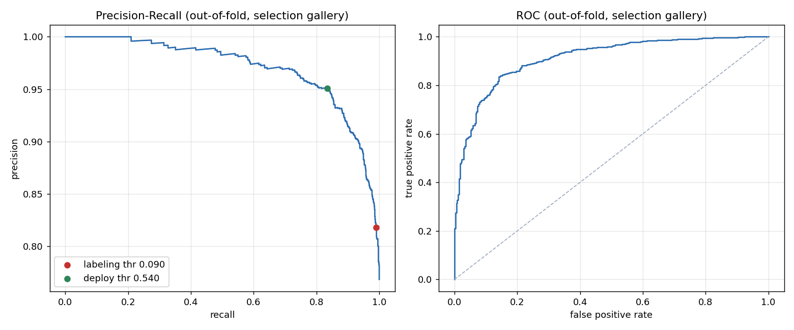

# Body-part fragment classifier

- Backbone: `v18` (SSL pretrain, pre-finetune) — `/data/AI/Tomer/dinov3/train_pictime/experiments_V2/V18/ckpt/19750`, which=`teacher`
- Dataset: `/data/AI/Tomer/person_reid/dataset_utils/dataset_finetune/Wedding[1]`
- Positive class: crop is ONLY body parts (`kept_keys`) -> discard before clustering
- Negative class: real, usable no-face person crop (`deleted_keys`)

## Labeled data

| gallery | positives | negatives | positive rate |
|---|---|---|---|
| `17601187` | 365 | 3717 | 0.0894 |
| `18226778` | 164 | 1295 | 0.1124 |
| `21833423` | 8 | 65 | 0.1096 |
| `24719889` | 209 | 1142 | 0.1547 |
| `26648310` | 1131 | 341 | 0.7683 |
| `31643124` | 933 | 425 | 0.6870 |

## Run 1 — selection (StratifiedKFold within `26648310`)

Optimistic in absolute terms (one gallery = one venue, one set of people). Valid for *ranking* variants. Ranked by PR-AUC — the prior is fixed within a gallery and PR-AUC is the more sensitive metric on the minority class.

| transform | features | model | PR-AUC | ROC-AUC |
|---|---|---|---|---|
| letterbox | cls+geom | `lr(C=0.01)` | 0.9702 | 0.9120 **<-** |
| letterbox | cls+geom | `lr(C=0.003)` | 0.9691 | 0.9095 |
| letterbox | cls | `lr(C=0.01)` | 0.9687 | 0.9087 |
| letterbox | cls+geom | `lr(C=0.03)` | 0.9686 | 0.9077 |
| letterbox | cls | `lr(C=0.003)` | 0.9681 | 0.9070 |
| letterbox | cls | `lr(C=0.03)` | 0.9672 | 0.9050 |
| warp | cls+geom | `lr(C=0.01)` | 0.9667 | 0.9077 |
| reid_val | cls+geom | `lr(C=0.01)` | 0.9666 | 0.9075 |
| warp | cls+geom | `lr(C=0.003)` | 0.9663 | 0.9078 |
| letterbox | cls+geom | `lr(C=0.001)` | 0.9660 | 0.9021 |
| reid_val | cls+geom | `lr(C=0.003)` | 0.9657 | 0.9070 |
| letterbox | cls | `lr(C=0.001)` | 0.9653 | 0.9002 |
| warp | cls | `lr(C=0.003)` | 0.9652 | 0.9048 |
| letterbox | cls+geom | `lr(C=0.1)` | 0.9651 | 0.8988 |
| warp | cls | `lr(C=0.01)` | 0.9651 | 0.9032 |
| reid_val | cls+geom | `lr(C=0.03)` | 0.9648 | 0.9025 |
| warp | cls+geom | `lr(C=0.03)` | 0.9647 | 0.9018 |
| reid_val | cls | `lr(C=0.01)` | 0.9643 | 0.9016 |
| reid_val | cls | `lr(C=0.003)` | 0.9639 | 0.9025 |
| letterbox | cls | `lr(C=0.1)` | 0.9633 | 0.8955 |
| warp | cls+geom | `lr(C=0.001)` | 0.9632 | 0.9014 |
| warp | cls | `lr(C=0.03)` | 0.9628 | 0.8960 |
| warp | cls | `lr(C=0.001)` | 0.9623 | 0.8995 |
| reid_val | cls+geom | `lr(C=0.1)` | 0.9622 | 0.8939 |
| reid_val | cls | `lr(C=0.03)` | 0.9619 | 0.8951 |
| reid_val | cls+geom | `lr(C=0.001)` | 0.9619 | 0.8995 |
| letterbox | cls+geom | `lr(C=0.3)` | 0.9610 | 0.8894 |
| reid_val | cls | `lr(C=0.001)` | 0.9606 | 0.8967 |
| reid_val | cls+geom | `lr(C=0.3)` | 0.9603 | 0.8861 |
| warp | cls+geom | `lr(C=0.1)` | 0.9602 | 0.8891 |
| reid_val | cls | `lr(C=0.1)` | 0.9591 | 0.8854 |
| letterbox | cls | `lr(C=0.3)` | 0.9589 | 0.8852 |
| reid_val | cls+geom | `lr(C=1)` | 0.9582 | 0.8783 |
| warp | cls | `lr(C=0.1)` | 0.9578 | 0.8823 |
| letterbox | cls+geom | `lr(C=1)` | 0.9571 | 0.8803 |
| reid_val | cls | `lr(C=0.3)` | 0.9570 | 0.8772 |
| warp | cls+geom | `lr(C=0.3)` | 0.9550 | 0.8749 |
| reid_val | cls | `lr(C=1)` | 0.9545 | 0.8686 |
| letterbox | cls | `lr(C=1)` | 0.9535 | 0.8732 |
| letterbox | cls+geom | `knn(k=5)` | 0.9535 | 0.8914 |
| warp | cls | `lr(C=0.3)` | 0.9523 | 0.8676 |
| letterbox | cls | `knn(k=5)` | 0.9499 | 0.8836 |
| warp | cls+geom | `lr(C=1)` | 0.9497 | 0.8605 |
| reid_val | cls+geom | `knn(k=5)` | 0.9484 | 0.8854 |
| warp | cls | `lr(C=1)` | 0.9465 | 0.8524 |
| reid_val | cls | `knn(k=5)` | 0.9459 | 0.8806 |
| warp | cls+geom | `knn(k=5)` | 0.9448 | 0.8795 |
| warp | cls | `knn(k=5)` | 0.9413 | 0.8713 |
| letterbox | geom | `knn(k=5)` | 0.9309 | 0.8433 |
| warp | geom | `knn(k=5)` | 0.9309 | 0.8433 |
| reid_val | geom | `knn(k=5)` | 0.9309 | 0.8433 |
| letterbox | geom | `lr(C=1)` | 0.9285 | 0.8145 |
| warp | geom | `lr(C=1)` | 0.9285 | 0.8145 |
| reid_val | geom | `lr(C=1)` | 0.9285 | 0.8145 |
| letterbox | geom | `lr(C=0.1)` | 0.9284 | 0.8148 |
| warp | geom | `lr(C=0.1)` | 0.9284 | 0.8148 |
| reid_val | geom | `lr(C=0.1)` | 0.9284 | 0.8148 |
| letterbox | geom | `lr(C=0.3)` | 0.9284 | 0.8146 |
| warp | geom | `lr(C=0.3)` | 0.9284 | 0.8146 |
| reid_val | geom | `lr(C=0.3)` | 0.9284 | 0.8146 |
| letterbox | geom | `lr(C=0.03)` | 0.9280 | 0.8135 |
| warp | geom | `lr(C=0.03)` | 0.9280 | 0.8135 |
| reid_val | geom | `lr(C=0.03)` | 0.9280 | 0.8135 |
| letterbox | geom | `lr(C=0.01)` | 0.9261 | 0.8080 |
| warp | geom | `lr(C=0.01)` | 0.9261 | 0.8080 |
| reid_val | geom | `lr(C=0.01)` | 0.9261 | 0.8080 |
| letterbox | geom | `lr(C=0.003)` | 0.9218 | 0.7959 |
| warp | geom | `lr(C=0.003)` | 0.9218 | 0.7959 |
| reid_val | geom | `lr(C=0.003)` | 0.9218 | 0.7959 |
| letterbox | geom | `lr(C=0.001)` | 0.9174 | 0.7844 |
| warp | geom | `lr(C=0.001)` | 0.9174 | 0.7844 |
| reid_val | geom | `lr(C=0.001)` | 0.9174 | 0.7844 |

**Selected:** `letterbox` / `cls+geom` / `lr(C=0.01)`

## Thresholds

Two gates, opposite objectives — do not collapse them into one number.

| gate | objective | threshold | recall | precision | FPR |
|---|---|---|---|---|---|
| labeling | recall >= 0.99 | 0.0897 | 0.9903 | 0.8181 | 0.7302 |
| deploy | precision >= 0.95 | 0.5400 | 0.8347 | 0.9507 | 0.1437 |

At the labeling gate the app would show 1369 of 1472 crops in the selection gallery (93.0% of the pool).

## Run 2 — leave-one-gallery-out

Recall and FPR are measured at the **labeling** threshold. FPR is tightly estimated wherever negatives are plentiful; recall is only as good as the positive count, hence the Wilson intervals.

| gallery | pos | neg | ROC-AUC | recall @ labeling thr | FPR @ labeling thr | note |
|---|---|---|---|---|---|---|
| `17601187` | 365 | 3717 | 0.8100 | 0.995 [0.98, 1.00] | 0.9026 [0.8927, 0.9117] |  |
| `18226778` | 164 | 1295 | 0.8131 | 0.988 [0.96, 1.00] | 0.8703 [0.8509, 0.8875] |  |
| `21833423` | 8 | 65 | 0.9654 | 1.000 [0.68, 1.00] | 0.3538 [0.2488, 0.4753] | THIN (<20 pos) — read as directional only |
| `24719889` | 209 | 1142 | 0.7863 | 0.990 [0.97, 1.00] | 0.9098 [0.8918, 0.9251] |  |
| `26648310` | 1131 | 341 | 0.7914 | 0.981 [0.97, 0.99] | 0.8152 [0.7706, 0.8528] |  |
| `31643124` | 933 | 425 | 0.8436 | 0.981 [0.97, 0.99] | 0.6282 [0.5813, 0.6728] |  |

## Geometry weights (shipped model, standardized features)

| feature | coefficient |
|---|---|
| `sqrt_rel_area` | -0.3608 |
| `log_crop_px` | -0.3302 |
| `touch_top` | +0.3020 |
| `touch_right` | +0.1888 |
| `touch_left` | +0.1625 |
| `touch_bottom` | +0.0401 |
| `log_n_dets` | +0.0371 |
| `max_iou_sibling` | -0.0276 |
| `center_y` | -0.0096 |
| `log_aspect` | +0.0051 |
| `area_rank` | -0.0036 |
| `conf` | +0.0000 |

## Run 3 — shipped model

- File: `/data/AI/Tomer/dinov3/train_pictime/classifier_body_parts/results/v18/model_v18.pkl`
- Trained on 9795 crops across 6 galleries (2810 positives)
- Not evaluated by design — run 1 selects, run 2 estimates, run 3 ships.

